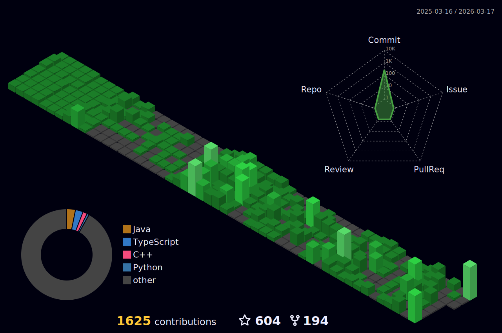

<!---  -->

<h3 align="center">
	Hello and welcome :smile:
</h3>

<h4 align="center">
	Head <a href="https://github.com/formidablae/formidablae/discussions/31">over here</a> to engage, share, ask questions and collaborate together!
</h4>

	

	

	

<!--- <h4 align="center">Most used languages by Lines of Code (in the last year only)</h4>

	

 -->

<h4 align="center">Views of all repositories (updated daily)</h4>

	

# Languages
<h4 align="center">Most used languages (by number of commits)</h4>

	

# Contributions
<h4 align="center">Isometric view of contributions in the last year. Languages pie is based on recent commits</h4>

	

# Projects

| Full-stack Projects | Issues & Pull Requests | Repo Size Info | Language Data |
|-|-|-|-|
|  |        |     |     |
|  |        |     |     |
|  |        |     |     |

| Back-end Projects | Issues & Pull Requests | Repo Size Info | Language Data |
|-|-|-|-|
|  |        |     |     |
|  |        |     |     |

| Front-end Projects | Issues & Pull Requests | Repo Size Info | Language Data |
|-|-|-|-|
|  |        |     |     |
|  |        |     |     |
|  |        |     |     |
|  |        |     |     |

| Data Science Projects | Issues & Pull Requests | Repo Size Info | Language Data |
|-|-|-|-|
|  |        |     |     |

# Technologies

# More in detail

	

