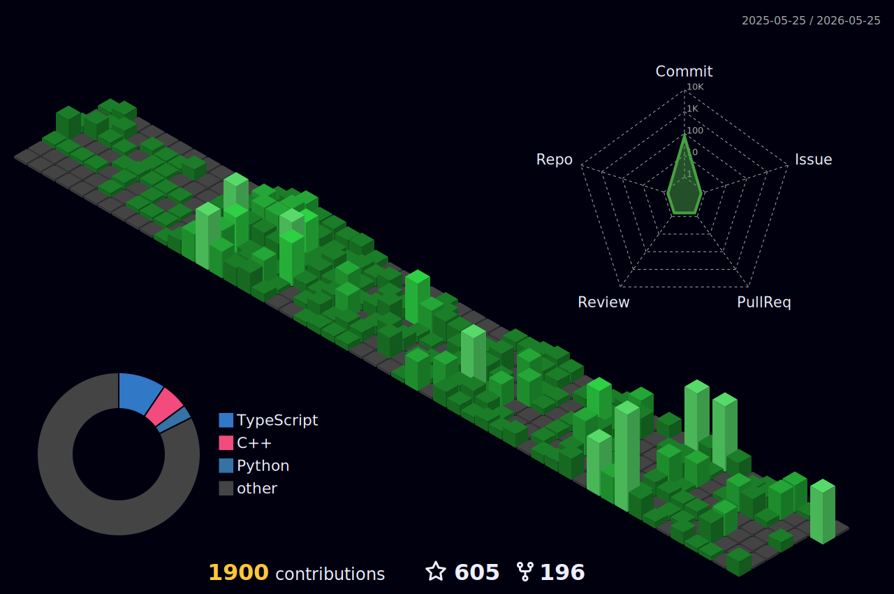

<h3 align="center">formidablae</h3>

	Founder & Lead Software Dev at <a href="https://github.com/savant-realms">Savant Realms</a> 
	Milan, Italy

	

	

	

## 3D Contributions

	

## Technologies

### CI/CD

### Databases

### Frameworks, Platforms and Libraries

### Hosting/SaaS

### ML/DL

### ORM

### Languages

### Testing

### Version Control

### Other

## Connect

