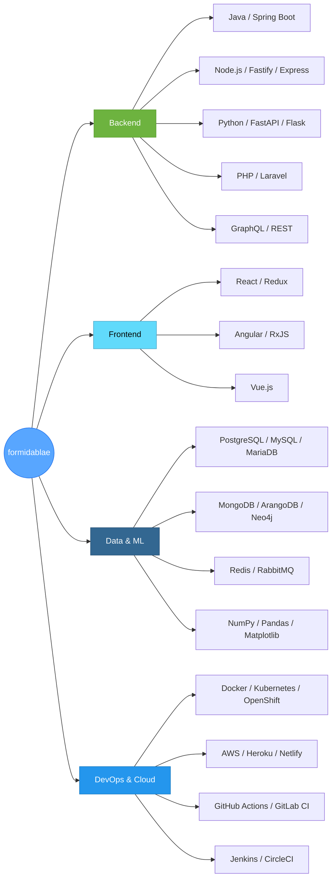
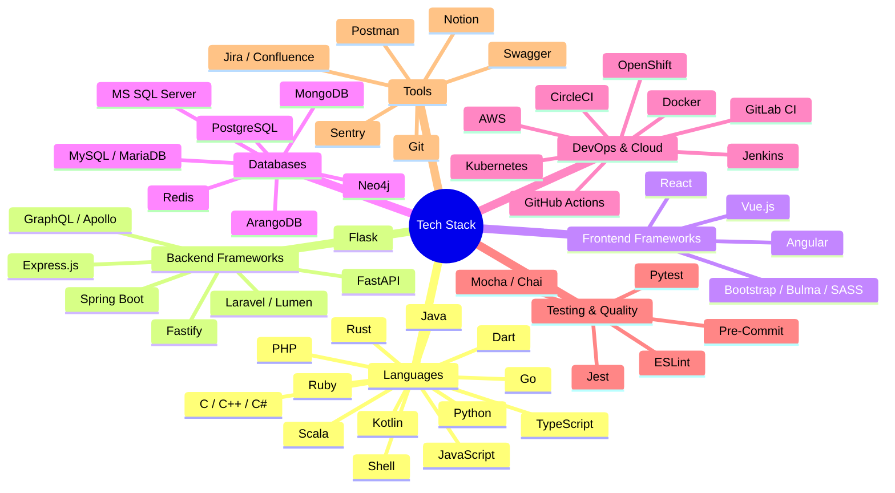

<h1 align="center">formidablae</h1>

  <strong>Founder & Lead Software Dev</strong> at <a href="https://github.com/savant-realms">Savant Realms</a> 
  Milan, Italy

  
  

---

## Architecture Focus

```mermaid
graph LR
  Me((formidablae)) --> BE["Backend"]
  Me --> FE["Frontend"]
  Me --> DM["Data & ML"]
  Me --> DO["DevOps & Cloud"]

  BE --> BE1["Java / Spring Boot"]
  BE --> BE2["Node.js / Fastify / Express"]
  BE --> BE3["Python / FastAPI / Flask"]
  BE --> BE4["PHP / Laravel"]
  BE --> BE5["GraphQL / REST"]

  FE --> FE1["React / Redux"]
  FE --> FE2["Angular / RxJS"]
  FE --> FE3["Vue.js"]

  DM --> DM1["PostgreSQL / MySQL / MariaDB"]
  DM --> DM2["MongoDB / ArangoDB / Neo4j"]
  DM --> DM3["Redis / RabbitMQ"]
  DM --> DM4["NumPy / Pandas / Matplotlib"]

  DO --> DO1["Docker / Kubernetes / OpenShift"]
  DO --> DO2["AWS / Heroku / Netlify"]
  DO --> DO3["GitHub Actions / GitLab CI"]
  DO --> DO4["Jenkins / CircleCI"]

  style Me fill:#58a6ff,stroke:#1f6feb,color:#fff
  style BE fill:#6db33f,stroke:#5a9e2f,color:#fff
  style FE fill:#61dafb,stroke:#4fa8c9,color:#000
  style DM fill:#336791,stroke:#2a5478,color:#fff
  style DO fill:#2496ed,stroke:#1a7bc2,color:#fff
```

## Tech Ecosystem

```mermaid
mindmap
  root((Tech Stack))
    Languages
      TypeScript
      JavaScript
      Java
      Python
      Go
      Rust
      Kotlin
      Dart
      C / C++ / C#
      PHP
      Scala
      Ruby
      Shell
    Backend Frameworks
      Spring Boot
      Fastify
      Express.js
      FastAPI
      Flask
      Laravel / Lumen
      GraphQL / Apollo
    Frontend Frameworks
      React
      Angular
      Vue.js
      Bootstrap / Bulma / SASS
    Databases
      PostgreSQL
      MySQL / MariaDB
      MongoDB
      ArangoDB
      Neo4j
      Redis
      MS SQL Server
    DevOps & Cloud
      Docker
      Kubernetes
      OpenShift
      AWS
      GitHub Actions
      GitLab CI
      Jenkins
      CircleCI
    Testing & Quality
      Jest
      Pytest
      Mocha / Chai
      ESLint
      Pre-Commit
    Tools
      Git
      Postman
      Swagger
      Sentry
      Jira / Confluence
      Notion
```

## GitHub Stats

  

  

  

## 3D Contributions

  

