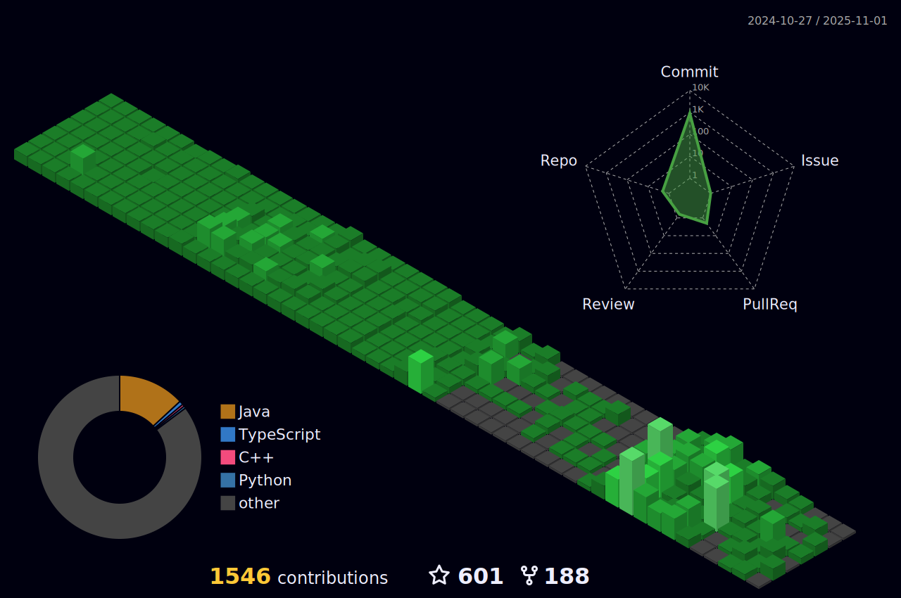

<!---  -->

<h3 align="center">
	Hello and welcome :smile:
</h3>

<h4 align="center">
	Head <a href="https://github.com/formidablae/formidablae/discussions/31">over here</a> to engage, share, ask questions and collaborate together!
</h4>

	

	

	

<h4 align="center">Lines of Code per language in the last year only</h4>

	

<h4 align="center">Views of all repositories (updated daily)</h4>

	

# Languages
<h4 align="center">Most used languages (by number of commits)</h4>

	

# Contributions
<h4 align="center">Isometric view of contributions in the last year. Languages pie is based on recent commits</h4>

	

# Projects

## Full-stack

	

	

	

## Back-end

	

	

## Front-end

	

	

	

	

## Data Science

	

# Technologies

### CI/CD

### Databases

### Frameworks, Platforms and Libraries

### Hosting/SaaS

### ML/DL

 <!--- TODO: Add shields.io matplotlib badge -->

### ORM
 <!--- TODO: Add shields.io Eloquent badge -->
 <!--- TODO: Add shields.io SQLAlchemy badge -->

### Programming & Markdown, Styling Languages

### Testing

### Version Control

### Other

# Metrics

	

